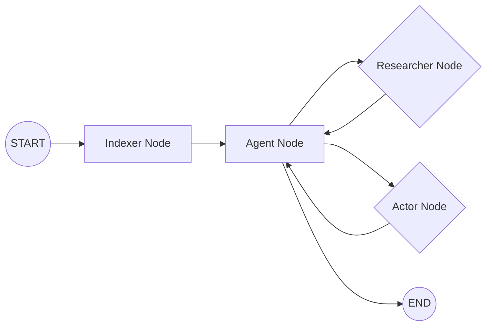

# @dastbal/nestjs-ai-agent 🧙‍♂️
### Autonomous Principal Software Engineer for NestJS

[](https://www.npmjs.com/package/@dastbal/nestjs-ai-agent)
[](https://opensource.org/licenses/MIT)

Transform your NestJS development with an agent that doesn't just "chat", but **operates** directly on your codebase with Senior-level precision. This version leverages a modular LangGraph architecture for enhanced control and validation.

---

## 🚀 Quick Start

```bash
# Install the agent
npm install @dastbal/nestjs-ai-agent

# Run your first command using the new LangGraph-based agent
# This command utilizes the Indexer, Researcher, and Actor nodes for robust operations.
npx node "Create a new Payments service with DDD patterns"

# The original 'gen' command is still available for backward compatibility:
# npx gen "Create a new Payments service with DDD patterns"
```

---

## 💎 Key Features

This agent operates with a strict set of principles and advanced capabilities:

*   **🧠 LangGraph Architecture:** Employs a modular graph with distinct nodes:
    *   **Indexer Node:** Automatically runs at the start to ensure the codebase RAG index is up-to-date.
    *   **Researcher Node:** Executes read-only operations like code analysis (`ask_codebase`) and file inspection (`safe_read_file`, `list_files`).
    *   **Actor Node:** Handles write operations (`safe_write_file`) and validation (`run_integrity_check`, `run_tests`).
*   **🔍 RAG Search:** Performs semantic search across your entire codebase before proposing changes, ensuring context-aware development.
*   **🩺 The Surgeon Rule:** Never overwrites a file without reading and analyzing it first, preserving existing logic and intent.
*   **✅ Self-Healing:** Runs integrity checks (TypeScript compiler) and attempts to auto-fix compilation errors (up to 3 retries).
*   **💾 Safe Writes:** Automatically creates backups before any file modification, ensuring data safety.
*   **🧠 SQLite Memory:** Remembers conversation threads and learned preferences across restarts using a local SQLite database.
*   **🔐 Configuration:** Leverages Google Vertex AI. Requires a service account JSON file (`credentials_vertex.json`) in the root folder and specific environment variables.

    **Credentials File:** Place your Google Service Account JSON in the root folder and name it exactly `credentials_vertex.json`.

    **Environment Variables:** Add the following to your `.env` file:
    ```dotenv
    GOOGLE_APPLICATION_CREDENTIALS="./credentials_vertex.json"
    GCP_PROJECT_ID="your-project-id"
    GCP_LOCATION="us-central1"
    ```
    **[CAUTION] Security First:** Always add `credentials_vertex.json` and `.env` to your `.gitignore` file to protect your credentials.

---

## ⚙️ Internal Workflow (LangGraph)

The agent follows a strict Principal Engineer protocol orchestrated by the LangGraph:



1.  **Initialization:** The graph starts with the **Indexer Node**, ensuring the codebase RAG index is current.
2.  **Reasoning:** The **Agent Node** (core LLM) analyzes the user's request and the indexed codebase.
3.  **Tool Selection:** Based on the request, the Agent Node routes to either the **Researcher Node** (for read operations) or the **Actor Node** (for write/validation operations).
4.  **Execution:**
    *   **Researcher Node:** Executes tools like `ask_codebase`, `safe_read_file`, `list_files`.
    *   **Actor Node:** Executes tools like `safe_write_file`, `run_integrity_check`, `run_tests`.
5.  **Feedback Loop:** Results from Researcher or Actor nodes are fed back to the Agent Node for further reasoning or task completion.
6.  **Validation:** The Actor Node ensures code integrity via `run_integrity_check` and `run_tests` after modifications.
7.  **Persistence:** Conversation history and agent state are managed via a checkpointer.

---

## 💡 Usage Examples

Try these commands to see the agent in action:

*   **Scaffolding:** `npx node "Create a UserEntity with email and password fields using TypeORM"`
*   **Logic Implementation:** `npx node "Add a validation pipe to the login DTO"`
*   **Testing:** `npx node "Write a unit test for the AuthService including mocks for the repository"`
*   **Refactoring:** `npx node "Standardize all HTTP exceptions in the users controller"`
*   **Code Generation:** `npx node "Generate a NestJS module for handling user authentication"`

---

## 🧠 Learning & Adaptation

The agent learns from your feedback. If you provide a style correction or a new pattern, it stores this information in `.agent/memories/style-guide.txt` to ensure future code generation aligns with your preferences.

---

## 📄 License

This project is released under the MIT License. Build something amazing! ✨
