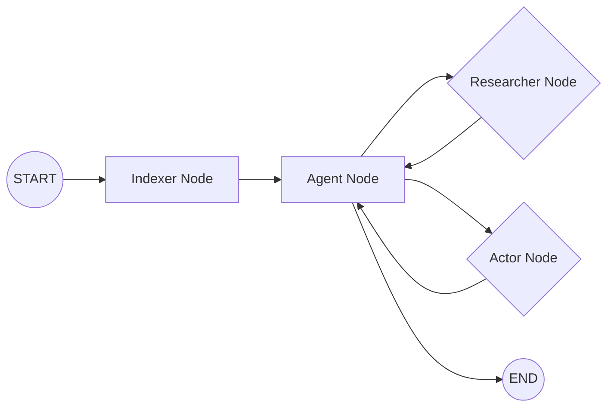

# @dastbal/nestjs-ai-agent 🧙‍♂️
### Autonomous Principal Software Engineer for NestJS

[](https://www.npmjs.com/package/@dastbal/nestjs-ai-agent)
[](https://opensource.org/licenses/MIT)

This document outlines the advancements in version 1.0.7, introducing a sophisticated LangGraph architecture with modularized tools and enhanced RAG capabilities.

---

## 🚀 Quick Start

```bash
# Install the agent (Version 1.0.7)
npm install @dastbal/nestjs-ai-agent@1.0.7

# Execute commands using the CLI
npx agent "Create a new Payments service with DDD patterns"
```

---

## 💎 Key Features & Architecture (v1.0.7)

This agent operates with a strict set of principles and advanced capabilities, now enhanced with Structural RAG:

*   **🧠 LangGraph Architecture:** A modular graph orchestrates agent execution with distinct nodes:
    *   **Indexer Node:** Automatically runs at startup to ensure the codebase RAG index is up-to-date.
    *   **Researcher Node:** Executes read-only operations using modular tools located in `src/core/tools` (e.g., `ask_codebase`, `safe_read_file`, `list_files`).
    *   **Actor Node:** Manages write operations and validation, also utilizing modular tools from `src/core/tools` (e.g., `safe_write_file`, `run_integrity_check`, `run_tests`).
*   **💡 Structural RAG with Skeletons & Dependency Graphs:**
    *   **Skeletons:** Provides a simplified, high-level representation of code structure (classes, methods, signatures) extracted via AST analysis. This allows the LLM to understand code without processing the entire file content, improving efficiency and focus.
    *   **Dependency Graphs:** `ask_codebase` now leverages dependency information to provide more accurate and context-aware results, understanding how different parts of the codebase relate to each other.
*   **🔍 RAG Search:** Performs semantic search across your entire codebase, enhanced by structural information, ensuring context-aware development.
*   **🩺 The Surgeon Rule:** Never overwrites a file without reading and analyzing it first, preserving existing logic and intent.
*   **✅ Self-Healing:** Runs integrity checks (`run_integrity_check`) and attempts to auto-fix compilation errors.
*   **💾 Safe Writes:** Automatically creates backups before any file modification, ensuring data safety.
*   **🧠 SQLite Memory:** Remembers conversation threads and learned preferences across restarts.
*   **🔐 Configuration:** Leverages Google Vertex AI. Requires `credentials_vertex.json` and specific environment variables.

    **Credentials File:** Place your Google Service Account JSON in the root folder as `credentials_vertex.json`.
    **Environment Variables:** Add the following to your `.env` file:
    ```dotenv
    GOOGLE_APPLICATION_CREDENTIALS="./credentials_vertex.json"
    GCP_PROJECT_ID="your-project-id"
    GCP_LOCATION="us-central1"
    ```
    **[CAUTION] Security First:** Add `credentials_vertex.json` and `.env` to your `.gitignore`.

---

## ⚙️ Internal Workflow (LangGraph)

The agent follows a strict Principal Engineer protocol orchestrated by the LangGraph:



1.  **Initialization:** The graph starts with the **Indexer Node**, ensuring the codebase RAG index is current.
2.  **Reasoning:** The **Agent Node** analyzes the request using the indexed codebase and structural information.
3.  **Tool Routing:** The Agent Node routes to either the **Researcher Node** (read operations) or the **Actor Node** (write/validation operations).
4.  **Execution:**
    *   **Researcher Node:** Executes tools from `src/core/tools` for read operations.
    *   **Actor Node:** Executes tools from `src/core/tools` for write/validation operations.
5.  **Feedback Loop:** Results are fed back to the Agent Node for further reasoning.
6.  **Validation:** The Actor Node ensures code integrity via `run_integrity_check` and `run_tests`.
7.  **Persistence:** Conversation history and agent state are managed via a checkpointer.

---

## 💡 Usage Examples

*   **Scaffolding:** `npx agent "Create a UserEntity with email and password fields using TypeORM"`
*   **Logic Implementation:** `npx agent "Add a validation pipe to the login DTO"`
*   **Testing:** `npx agent "Write a unit test for the AuthService including mocks for the repository"`
*   **Refactoring:** `npx agent "Standardize all HTTP exceptions in the users controller"`
*   **Code Generation:** `npx agent "Generate a NestJS module for handling user authentication"`

---

## 🧠 Learning & Adaptation

The agent learns from feedback, storing preferences in `.agent/memories/style-guide.txt`.

---

## 📄 License

This project is released under the MIT License. Build something amazing! ✨
